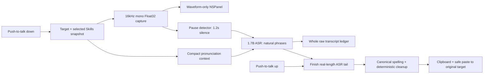

# Architecture

Audio Smith is a menu-bar macOS application. AppKit owns global keyboard monitoring, the non-activating overlay, target restoration, and paste safety; AVAudioEngine captures audio; MLXAudio Swift runs one Qwen3-ASR-1.7B 8-bit model; SwiftUI provides settings and status views.

## Request data flow



The panel never shows provisional text. Release changes the state to `finalizing` before any model await, freezes and dims the waveform, and starts a time-driven progress ring. It waits only for the unfinished ASR tail and cleanup; there is no second-model stage.

## State machine

```text
downloading → loading → ready → recording → finalizing → ready
     │           │         │          │            │
     └───────────┴─────────┴──────────┴────────────┴──→ error
```

- `downloading`: missing model files are fetched, verified, and atomically installed.
- `loading`: the ASR model is loaded and silently prewarmed.
- `ready`: a request can snapshot the current Skills.
- `recording`: natural phrases are decoded serially by Qwen3-ASR-1.7B.
- `finalizing`: the unfinished ASR tail completes, then canonical spelling and deterministic cleanup run.
- `error`: permission, model, microphone, inference, or disk failures are surfaced without persisting speech.

Changing Skill selections or files during a request does not mutate its snapshot. The next accepted shortcut press rescans and captures the new selection.

## Shortcut, cancellation, and paste safety

An event tap observes the selected physical modifier key. `Fn` is the default; right Option, right Control, and right Command persist across launches. Function-key or modifier chords cancel dictation without consuming the original shortcut.

During recording or finalization, `Esc` cancels the request. A late segment result is ignored through the request UUID. Secure fields and invalid targets never receive simulated paste, but a successfully completed final text remains on the clipboard.

## Pause-segmented ASR and short audio

The only model is the pinned `mlx-community/Qwen3-ASR-1.7B-8bit`. Application-level segmentation is driven by the waveform rather than a fixed timer. After a phrase accumulates at least 1.5 seconds of voiced audio, 1.2 seconds of continuous low energy confirms a natural boundary. The cut is centered inside the silence and retains 400ms of overlap, so both sides keep guard audio without clipping a boundary phoneme. The model's audio tower may still use its own internal encoder blocks; those blocks do not choose the application's sentence boundaries.

A pause shorter than 1.2 seconds does not close a phrase. If speech continues without any qualifying pause, a 30-second safety limit selects the lowest-energy run in the final five seconds. This fallback is bounded rather than periodic: normal speech remains pause segmented, and speech-overlap stitching is needed only at a safety-limit boundary.

All MLX ASR calls run serially on a dedicated queue. The realtime microphone callback only appends samples. A completed natural phrase is decoded invisibly while capture continues, so release usually waits only for the final unfinished phrase. Natural-pause results are joined as independent clauses. Safety-limit overlaps use lexical longest-suffix/longest-prefix stitching that ignores case, spacing, and punctuation; a weak seam may trigger a recovery decode bounded to at most 12 seconds. The application never re-runs a complete long recording merely because one local seam is weak.

On key release, any unfinished voiced tail is decoded at its true length, even when it is shorter than the 1.5-second automatic-segmentation minimum. A request below the model's 0.5-second minimum is padded with trailing zeros only to that minimum. If voiced audio produces empty text, one and only one retry appends 250ms of silence. Pure silence is rejected without inference. If the user releases during silence after a phrase was already decoded, the silent tail is not decoded again. Reported duration and stitch locations always use unpadded audio time.

The five-minute request limit bounds capture. At 16kHz Float32, retaining a five-minute waveform for tail and local recovery is about 19.2MB. It is released after completion or cancellation.

## Skill snapshot

Before every accepted key press, Audio Smith rescans:

```text
~/Library/Application Support/AudioSmith/Skills/<name>/SKILL.md
```

The checked set is sorted, deduplicated, bounded, and captured as one immutable `DomainSkill`. Up to 40 preferred terms and spoken forms are rendered into at most 1,000 compact characters and supplied to each ASR segment as recognition context. Free-form Markdown is not sent to the model. The bounded full pronunciation dictionary remains available for conservative canonical spelling cleanup after recognition. Skill documents are data and never execute code, tools, scripts, or linked resources. See [Skills](SKILLS.md).

## Model installation and source selection

One manifest pins the ASR repository, immutable Hugging Face revision, file sizes, and SHA-256 digests. The same content manifest validates ModelScope. Automatic mode races only the two mirrors' small `config.json` files and accepts the first response whose size and SHA-256 match; no third-party IP-location service is used.

Downloads support HTTP Range resume. Three consecutive failures switch to the other mirror; already verified files remain, while the current incomplete file is discarded before switching. Installation uses a staging directory and atomic move. Once installed, startup and dictation do not probe the network.

## MLX serialization and memory gate

ASR phrase decoding, tail finalization, seam recovery, and prewarm all use one serialized engine. The realtime audio callback never performs inference, and stale work does not accumulate. Retired 0.6B-ASR and text-refiner cache directories are removed by an exact-name migration; the current 1.7B model, Skills, and settings are never targeted.

- 4.7GB process footprint: runtime diagnostic warning
- 5.0GB process footprint: binary-release blocker

These limits cover the complete process. Passing requires live five-minute testing on the M1 Pro 32GB development machine and at least one 24GB Apple Silicon Mac. Current evidence is documented in [Benchmarks](BENCHMARKS.md).
