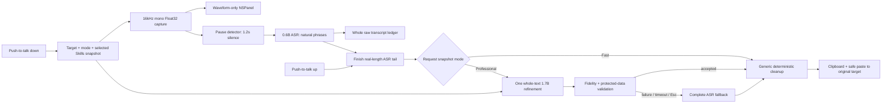

# Architecture

Audio Smith is a menu-bar macOS application. AppKit owns global keyboard monitoring, the non-activating overlay, target restoration, and paste safety; AVAudioEngine captures audio; MLXAudio Swift runs Qwen3-ASR; MLX Swift LM runs the optional text refiner; SwiftUI provides settings and status views.

## Request data flow



The panel never shows provisional text. Release changes the state to `finalizing` before any model await, freezes and dims the waveform, and starts a time-driven progress ring. Professional mode labels the operation and allows `Esc` to bypass the LLM.

## State machine

```text
downloading → loading → ready → recording → finalizing → ready
     │           │         │          │            │
     └───────────┴─────────┴──────────┴────────────┴──→ error
```

- `downloading`: missing model files are fetched, verified, and atomically installed.
- `loading`: required models are loaded and silently prewarmed in series.
- `ready`: a request can snapshot the current mode and Skills.
- `recording`: only 0.6B ASR work runs; no text LLM is invoked.
- `finalizing`: the ASR tail completes, then Professional mode makes exactly one full-transcript LLM request. Fast mode goes directly to cleanup.
- `error`: permission, model, microphone, inference, or disk failures are surfaced without persisting speech.

Changing settings during a request does not mutate its snapshot. Turning Professional mode off unloads the refiner after the current request. Re-enabling it downloads, verifies, loads, and prewarms the model before the app returns to `ready`.

## Shortcut, cancellation, and paste safety

An event tap observes the selected physical modifier key. `Fn` is the default; right Option, right Control, and right Command persist across launches. Function-key or modifier chords cancel dictation without consuming the original shortcut.

During recording, `Esc` cancels the entire request. During Professional finalization it marks the generation result unusable and pastes the complete ASR fallback as soon as the ASR tail is available; a late model result is ignored through the request UUID. Secure fields and invalid targets never receive simulated paste, but the final text remains on the clipboard.

## Pause-segmented ASR and short audio

The ASR model is the pinned `mlx-community/Qwen3-ASR-0.6B-8bit`. Application-level segmentation is driven by the waveform rather than a fixed timer. After a phrase accumulates at least 1.5 seconds of voiced audio, 1.2 seconds of continuous low energy confirms a natural boundary. The cut is centered inside the silence and retains 400ms of overlap, so both sides keep guard audio without clipping a boundary phoneme. The model's audio tower may still use its own internal encoder blocks; those blocks do not choose the application's sentence boundaries.

A pause shorter than 1.2 seconds does not close a phrase. If speech continues without any qualifying pause, a 30-second safety limit selects the lowest-energy run in the final five seconds. This fallback is bounded rather than periodic: normal speech remains pause segmented, and speech-overlap stitching is needed only at a safety-limit boundary.

All MLX ASR calls run serially on a dedicated queue. The realtime microphone callback only appends samples. A completed natural phrase is decoded invisibly while capture continues, so release usually waits only for the final unfinished phrase. Natural-pause results are joined as independent clauses. Safety-limit overlaps use lexical longest-suffix/longest-prefix stitching that ignores case, spacing, and punctuation; a weak seam may trigger a recovery decode bounded to at most 12 seconds. The application never re-runs a complete long recording merely because one local seam is weak.

On key release, any unfinished voiced tail is decoded at its true length, even when it is shorter than the 1.5-second automatic-segmentation minimum. A request below the model's 0.5-second minimum is padded with trailing zeros only to that minimum. If voiced audio produces empty text, one and only one retry appends 250ms of silence. Pure silence is rejected without inference. If the user releases during silence after a phrase was already decoded, the silent tail is not decoded again. Reported duration and stitch locations always use unpadded audio time.

The five-minute request limit bounds capture. At 16kHz Float32, retaining a five-minute waveform for tail and local recovery is about 19.2MB. It is released after completion or cancellation.

## Whole-transcript professional refinement

The optional refiner is the pinned `Qwen/Qwen3-1.7B-MLX-4bit`. It is never called for a segment or during recording. After ASR finishes, the complete raw transcript and the request's Skill snapshot are submitted once with thinking disabled and strict copy-editing instructions: only homophones, terminology, capitalization, duplicate fragments, spacing, and punctuation may change.

Input is limited to 24K tokens while reserving at least 8K tokens for output. Skill context is trimmed before transcript text; if the complete transcript itself cannot fit, the request safely uses the ASR fallback. The output budget is `original tokens × 1.25 + 32`, capped at 8K. Timeout is `2 seconds + budget / 20 tokens/s`, clamped to 3–45 seconds.

The candidate must be nonempty and free of thinking, role, and protocol text; stay within the configured length and normalized edit-distance bounds; and preserve every number sequence, URL, and email address. Any exception, timeout, cancellation, or validation failure uses the complete ASR text. The refiner is not allowed to answer, summarize, translate, or expand the speaker.

## Skill snapshot

Before every accepted key press, Audio Smith rescans:

```text
~/Library/Application Support/AudioSmith/Skills/<name>/SKILL.md
```

The checked set is sorted, deduplicated, bounded, and captured as one immutable `DomainSkill`. Up to 300 preferred terms and 8,000 prompt characters are available. Skills never enter ASR. They enter only the single Professional-mode refinement prompt and the final safe alias cleanup. Fast mode uses the General snapshot and ignores domain replacements. Skill documents are data and never execute code, tools, scripts, or linked resources. See [Skills](SKILLS.md).

## Model installation and source selection

Separate manifests pin the ASR and refiner repositories, immutable Hugging Face revisions, file sizes, and SHA-256 digests. The same content manifest validates ModelScope. Automatic mode races only the two mirrors' small `config.json` files and accepts the first response whose size and SHA-256 match; no third-party IP-location service is used.

Downloads support HTTP Range resume. Three consecutive failures switch to the other mirror; already verified files remain, while the current incomplete file is discarded before switching. Installation uses a staging directory and atomic move. Once installed, startup and dictation do not probe the network.

## MLX serialization and memory gate

ASR checkpoints, ASR finalization, refiner loading, prewarm, and generation are sequenced so the two resident models do not infer concurrently. Professional mode keeps both models resident for warm first use. Fast mode unloads the 1.7B container and clears eligible MLX caches while leaving verified weights on disk.

- 4.7GB process footprint: runtime diagnostic warning
- 5.0GB process footprint: Professional-mode binary-release blocker

These limits cover the complete process. Passing requires live five-minute testing on the M1 Pro 32GB development machine and at least one 24GB Apple Silicon Mac. Current evidence is documented in [Benchmarks](BENCHMARKS.md).
