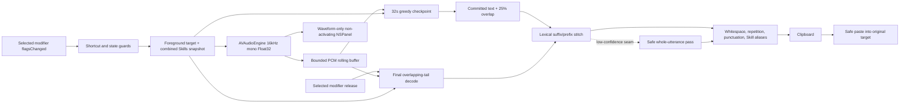

# Architecture

Audio Smith is a menu-bar macOS application. AppKit owns global keyboard monitoring, the non-activating overlay, target-app restoration, and paste safety; AVAudioEngine captures audio; MLXAudio Swift runs the pinned Qwen3-ASR model; SwiftUI provides settings and status views.

## Request data flow



The panel is visible across Spaces and full-screen applications and is positioned on the screen associated with the original foreground window. It does not become the key application.

## State machine

The application exposes one authoritative lifecycle:

```text
downloading → loading → ready → recording → finalizing → ready
     │           │         │          │            │
     └───────────┴─────────┴──────────┴────────────┴──→ error
```

- `downloading`: resumable model transfer into a temporary location, followed by manifest verification and atomic installation.
- `loading`: model creation and one silent prewarm.
- `ready`: the model remains resident and a new push-to-talk request may begin.
- `recording`: audio capture and serialized rolling checkpoints are active; only the waveform is displayed.
- `finalizing`: capture has stopped; the overlapping tail is decoded, stitched, and cleaned before paste. A whole-utterance pass runs only when a seam cannot be matched safely.
- `error`: a permission, model, microphone, inference, or memory failure is surfaced without storing speech.

`Esc`, a function-key chord, or a failed guard cancels the active request and discards its in-memory buffers.

## Shortcut and target-app handling

An event tap observes global `flagsChanged` events for the selected physical modifier key. `Fn` is the default; right Option, right Control, and right Command are available and persist across launches. The press is accepted only from `ready`, after the app snapshots the active application, focused element metadata needed for paste safety, current screen, and combined Skills selection. A short silent press produces no text.

If F1–F12 participates while Fn is held, or any normal key participates while another activation modifier is held, Audio Smith cancels recording and does not consume the original shortcut. Final paste is skipped for secure input elements or when the original target is no longer valid; the transcript remains on the clipboard.

## Audio and rolling long-context inference

AVAudioEngine input is converted to 16kHz, one-channel Float32 samples before entering the inference layer. The two independent timing parameters are the model's native approximately 8-second encoder window and Audio Smith's 32-second refinement window. Overlap is always derived as 25% of the refinement window, so the default stride is 24 seconds. Choosing a 16-second refinement window would derive a 4-second overlap and a 12-second stride without introducing a third user-facing timing parameter.

During capture, raw PCM enters a bounded rolling buffer. At 32 seconds the app performs the first greedy checkpoint; subsequent checkpoints cover `[24, 56]`, `[48, 80]`, and so on. Each call uses the pinned MLXAudio Swift public Qwen generation API, whose audio tower handles its native encoder blocks internally. MLX passes are serialized on a dedicated queue, while the realtime audio callback only appends samples to that queue. The overlay stays waveform-only, so internal checkpoint corrections cannot cause visible text jitter.

Adjacent hypotheses are combined with a lexical longest-suffix/longest-prefix seam that ignores case, whitespace, and punctuation while retaining the newer wording inside the overlap. On shortcut release, Audio Smith decodes only the unfinished tail beginning at the previous checkpoint's overlap. If the seam has no reliable two-unit anchor, it refuses to guess and runs one safe whole-utterance pass instead. This fallback protects transcript integrity but has higher release latency.

The five-minute request limit bounds a single capture. The rolling inference buffer retains only the audio needed by the next window. `AudioCapture` separately retains the request waveform for the low-confidence fallback; 16kHz Float32 audio is approximately 19.2MB at the five-minute limit and is discarded after completion or cancellation. The rolling path still requires real five-minute memory and latency validation; the design alone is not evidence that the 5GB release gate passes.

## Skill snapshot

Before each accepted push-to-talk press, the Skill repository rescans:

```text
~/Library/Application Support/DictateAgent/Skills/<name>/SKILL.md
```

The product seeds one editable AIGC starter into the user directory. Advanced users may add more Skills, which are presented as independent checkboxes. The selected set is sorted deterministically, deduplicated, and combined into an immutable value owned by that request. Markdown body sections other than Vocabulary become bounded ASR context; Vocabulary becomes preferred terms and aliases. The combined prompt is capped at 8,000 characters and 300 unique preferred terms; no selection produces the General snapshot. Edits saved during recording cannot alter active inference and are discovered on the next request. Skills never execute code, tools, scripts, or linked resources. See [Skills](SKILLS.md).

The immutable request snapshot is supplied to every rolling checkpoint, the final tail, and any safety fallback. Deterministic alias replacement and punctuation/spacing cleanup then run once; no second local language model is loaded.

## Model installation and offline boundary

The model manifest fixes the Hugging Face revision, expected files, sizes, and SHA-256 values. Downloads support resume, use temporary paths, verify every file, and install atomically. Model weights are neither bundled into the app source nor committed to Git.

After a verified installation, capture, inference, Skill loading, cleanup, and paste are local. The core request path does not require network access and does not persist audio or transcript history.

## Memory gate

The 1.7B 8-bit model stays resident to avoid a cold first request. Startup performs a silent prewarm; each checkpoint and request finalization clear eligible MLX caches, and cancellation releases the rolling PCM and hypotheses.

- 4.7GB physical footprint: runtime diagnostic warning
- 5.0GB physical footprint: binary-release blocker

These thresholds cover the complete app process, not only tensor allocations. Passing the gate requires live five-minute testing on both the M1 Pro 32GB development machine and at least one 24GB Apple Silicon Mac. Current evidence is documented in [Benchmarks](BENCHMARKS.md).
